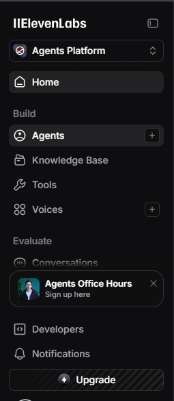
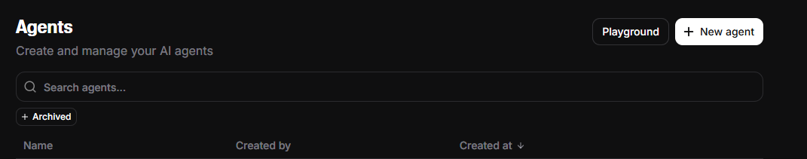
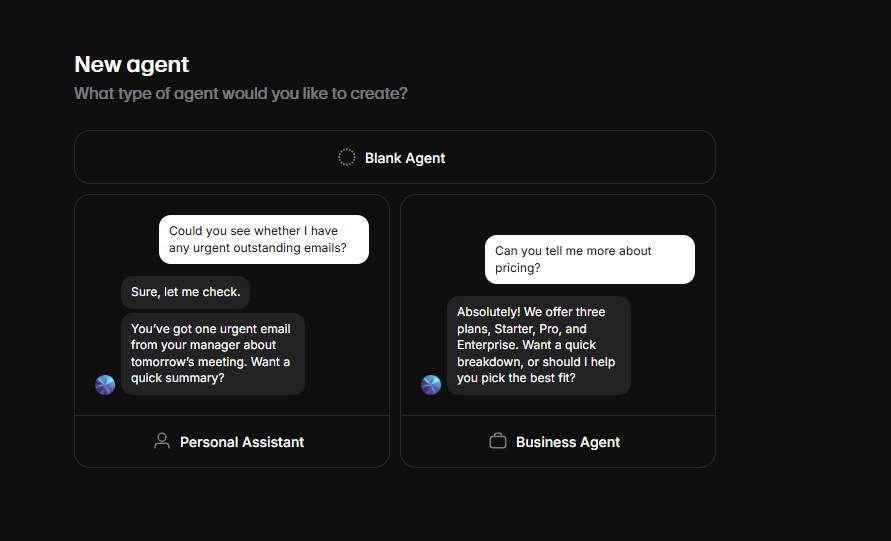
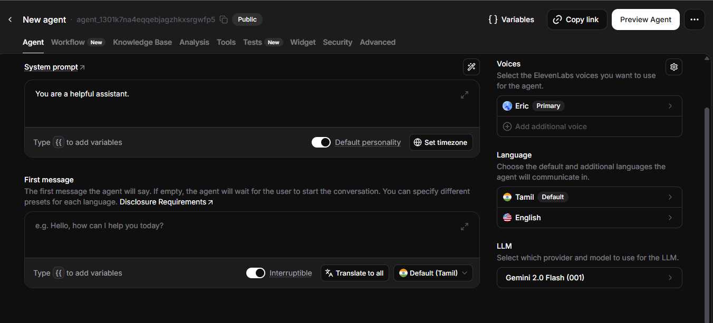
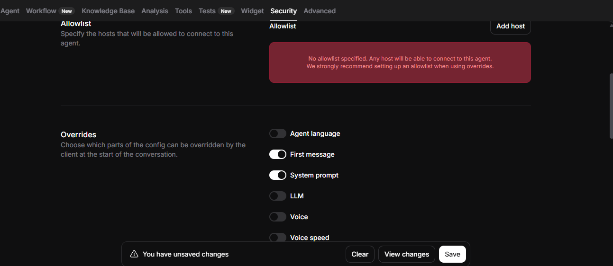
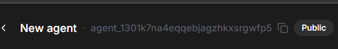
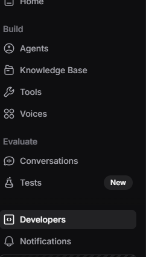
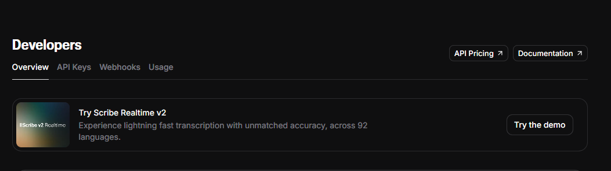
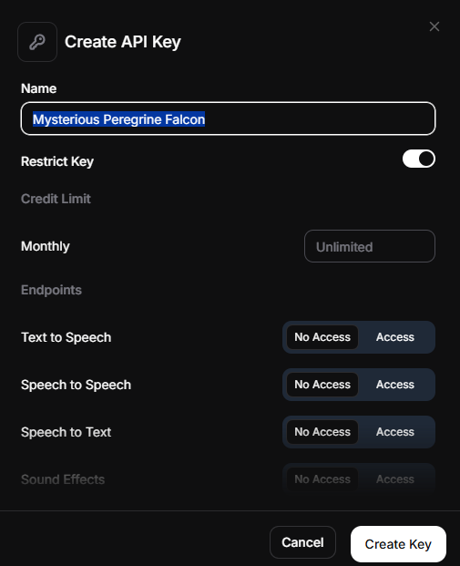
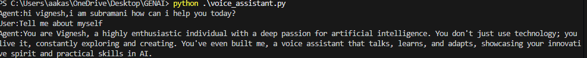

<h2>Subramani-Voice assistance</h2>
Subramani is an AI-powered voice assistant built using **ElevenLabs Conversational AI**.  
The project follows the workflow from Codedex.io’s tutorial and extends it with your own agent configuration.  
Subramani can listen, respond, and speak naturally—making it a simple but powerful voice companion

___
<h3>Project Overview</h3>
This project demonstrates how to create a <b>voice-controlled assistant</b> using:
<ul>
    <li> ElevenLabs Agent </li>
     <li>ElevenLabs Conversational AI API</li>
     <li>Python scripting</li>
     <li>Environment variables for secure authentication</li>
     </ul>
You can customize Subramani’s behavior, tone, and personality directly in the ElevenLabs dashboard.

___
<h3>Project Structure</h3>
```bash
voice-assistant/
│
├── main.py                # Main script to run the assistant
├── requirements.txt       # Python dependencies
├── .env                   # API keys and agent id (not included in repo)
├── README.md              # Documentation
 ```

Elevenlabs is a platform where we can create voice agents. now let see the steps to create a agent

___

<h3>Install Required Packages</h3>
Before we start, make sure you have Python installed. Then, install the required dependencies:
```bash
pip install elevenlabs elevenlabs[pyaudio] python-dotenv
```
___

<h3>Creation of a Agent </h3>
<h4>Step1</h4>
Create a account in **elevenlabs** and go to agent column 



<h4>Step2</h4>
Click new agent and start it from a blank ,give a name for it.






<h4>Step3</h4>
Customize your agent by giving **name, language,  behavior and LLM** model for your requirements and go to security enable a *first message* and *system prompt*



<b>Security</b>



<h4>Step4</h4>
Finally copy the **agent id** at top of the column. 


___
<h3>API Creation</h3>
<h4>Step1 </h4>
Open the developer column



<h4>Step2</h4>
Then in the right side click the API keys column



<h4>Step3</h4>
click create API button for api creation


<h4>Step4</h4>
After that give the permission for the api to access and copy the API



___
<h3>Environment setup</h3>


create a .env file then add the copyed **agent id** and **Elevenlabs API** and then finally run the code given 

**1**  Add the id and api correctly
```python
AGENT_ID=your_elevenlabs_agent_id
API_KEY=your_elevenlabs_api_key
```

**2** Run your script
```python
python main.py
```
---
<h3>Execution </h3>
Write python with the filename you given




___
<h3>Features</h3>
<ul>
<li>Real-time conversational AI from ElevenLabs</li>
<li>Natural speech responses</li>
<li>Customizable agent personality</li>
<li>Secure API key handling</li>

</ul>
___
<h3>Acknowledgements</h3>
<ul>
<li><b>Codedex.io</b>– Original project inspiration</li>
<li><b>ElevenLabs</b> – Conversational AI platform</li>
</ul>
___
<h3>Author</h3>
Vignesh N
 
 
